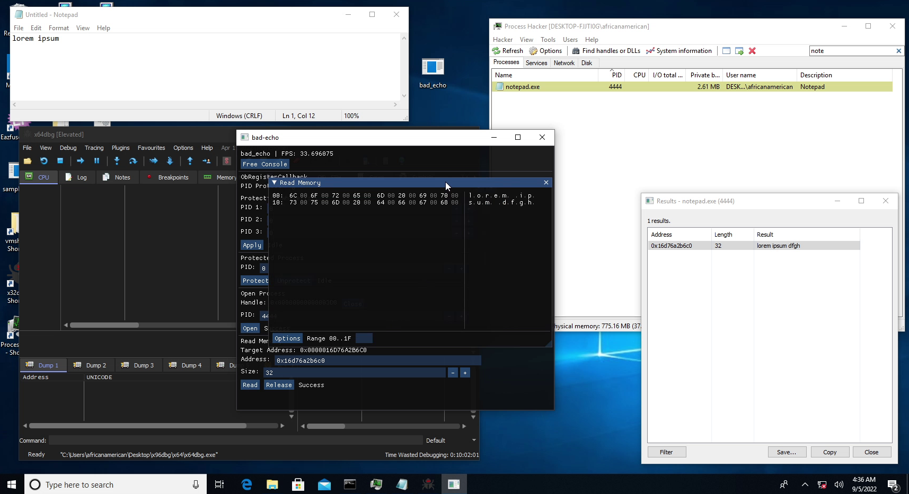

# bad-echo-driver
Protect, Unprotect, Filter handles, Create handle, and Read memory by abusing a signed Kernel driver.

## Features
* Strip process / thread handles with ObRegisterCallback.
* Mark and unmark process as a protected process.
* Create handle
* Read memory

## Dependencies
* [kita](https://github.com/u16rogue/kita) - ImGui and GLFW boilerplate
* [imgui_club](https://github.com/ocornut/imgui_club) - For the hex editor component

## Thanks
* [eternal / sam](https://github.com/git-eternal) - Providing the binaries
